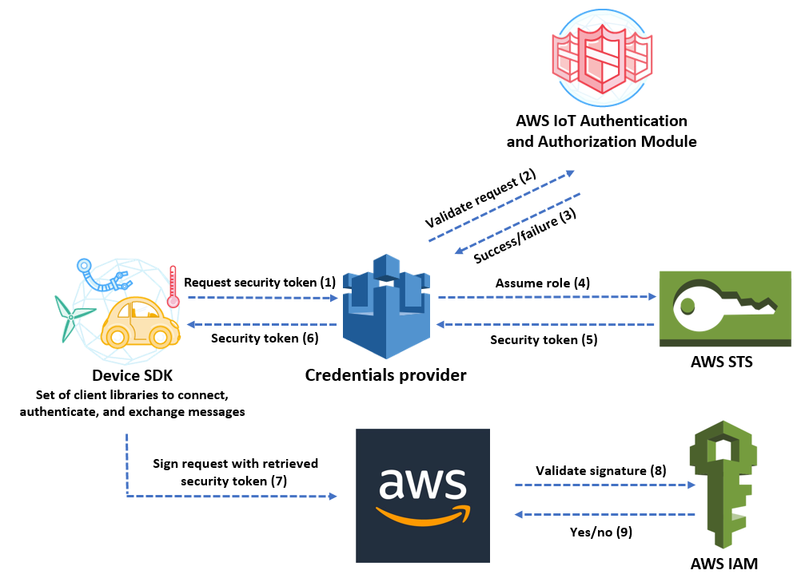

# aws-iot-cpp-credential-provider
## Authorizing Direct Calls to AWS Services with AWS IoT Credentials Provider C++ example powered by curlpp and libcurl




## 1. References
* [Authorizing Direct Calls to AWS Services ](https://docs.aws.amazon.com/iot/latest/developerguide/authorizing-direct-aws.html)

* [How to Eliminate the Need for Hardcoded AWS Credentials in Devices by Using the AWS IoT Credentials Provider](https://aws.amazon.com/jp/blogs/security/how-to-eliminate-the-need-for-hardcoded-aws-credentials-in-devices-by-using-the-aws-iot-credentials-provider/)

* [Basic curlapp example](https://github.com/jpbarrette/curlpp/blob/8810334c830faa3b38bcd94f5b1ab695a4f05eb9/examples/example02.cpp)

* [Shows HTTPS usage with client certs and optional ssl engine use - libcurl example](https://curl.haxx.se/libcurl/c/simplessl.html)


* [cURLpp - a C++ wrapper for libcURL](http://www.curlpp.org/)

## 2. Complie & Build
*This guide is for macOS mojave and it is similar on linux*

## 2-1. Check curl
```
$ curl --version
curl 7.54.0 (x86_64-apple-darwin18.0) libcurl/7.54.0 LibreSSL/2.6.5 zlib/1.2.11 nghttp2/1.24.1
Protocols: dict file ftp ftps gopher http https imap imaps ldap ldaps pop3 pop3s rtsp smb smbs smtp smtps telnet tftp 
Features: AsynchDNS IPv6 Largefile GSS-API Kerberos SPNEGO NTLM NTLM_WB SSL libz HTTP2 UnixSockets HTTPS-proxy 
```

## 2-2. Check curl
```
$ g++ --version
Configured with: --prefix=/Library/Developer/CommandLineTools/usr --with-gxx-include-dir=/Library/Developer/CommandLineTools/SDKs/MacOSX10.14.sdk/usr/include/c++/4.2.1
Apple LLVM version 10.0.1 (clang-1001.0.46.4)
Target: x86_64-apple-darwin18.7.0
Thread model: posix
InstalledDir: /Library/Developer/CommandLineTools/usr/bin
```

## 2-3. Install curlpp library
```
$ brew install curlpp

$ curlpp-config --cflags --libs
```

## 2-4. Build executable
```
$ g++ -std=c++11 src/example.cpp -o bin/iotcred -lcurl -lcurlpp
```

## 3. Run
```
./bin/iotcred
```
